<picture>
  <source media="(prefers-color-scheme: dark)" srcset="assets/banner-dark.svg">
  <source media="(prefers-color-scheme: light)" srcset="assets/banner-light.svg">
  
</picture>

I build and maintain server-side applications in PHP and Symfony — domain modelling, HTTP APIs,
data persistence, and the tooling that keeps them shippable. Four years in: backend by preference,
plus the systems and delivery work that surrounds it.

---

### Core

### JavaScript

### Data

### Infrastructure &amp; tooling

### Servers &amp; monitoring

### AI

---

### Terminal-first

Arch Linux and zsh, day in day out. Most of what I do starts at a prompt.

---

### Systems &amp; operations

Provisioning and hardening servers, users and permissions, Zabbix monitoring, backups — the unglamorous half that keeps the other half running.

---

### Delivery

Owning the path from a merged pull request to a running production server: pipeline definition, environment parity, database migrations, and the release itself.

- **One artifact, promoted.** What reaches production is the build that already passed preprod, not a fresh one.
- **Migrations travel with the code.** Schema changes ship alongside the commits that need them.
- **Preprod earns its name.** Same OS, same service versions, same configuration shape as production.
- **Every release has a way back.** A deploy nobody can reverse is not finished.

<!--
  ────────────────────────────────────────────────────────────────
  PROJECTS — uncomment this block once you have public repositories.
  Replace each row; delete the ones you do not use.
  ────────────────────────────────────────────────────────────────

### Projects

| Project | What it does | Stack |
| --- | --- | --- |
| **[repo-name](https://github.com/AlexandreRomagnoli/repo-name)** | One line on the problem it solves. | Symfony · PostgreSQL |
| **[repo-name](https://github.com/AlexandreRomagnoli/repo-name)** | One line on the problem it solves. | PHP · Redis |

-->

---

  

